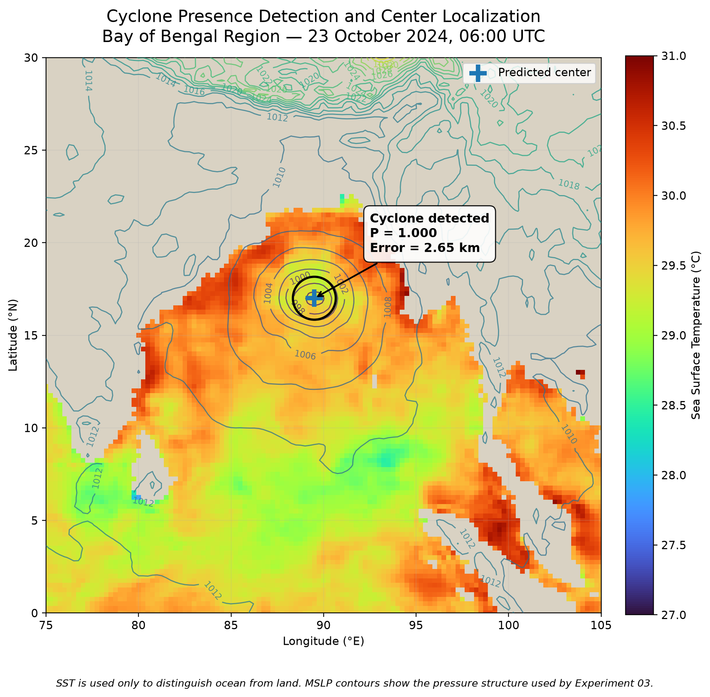
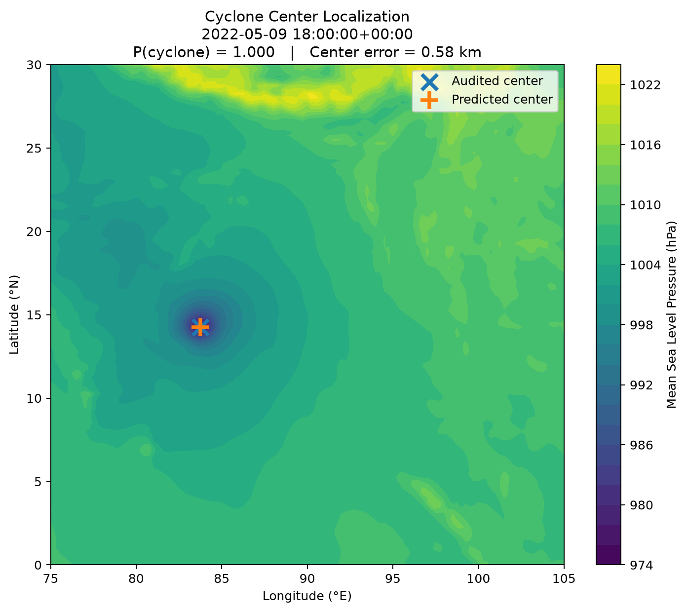
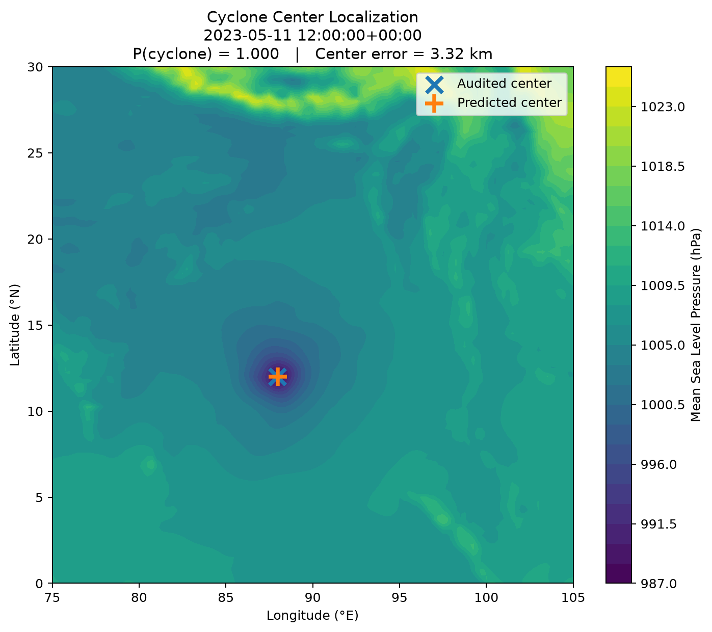
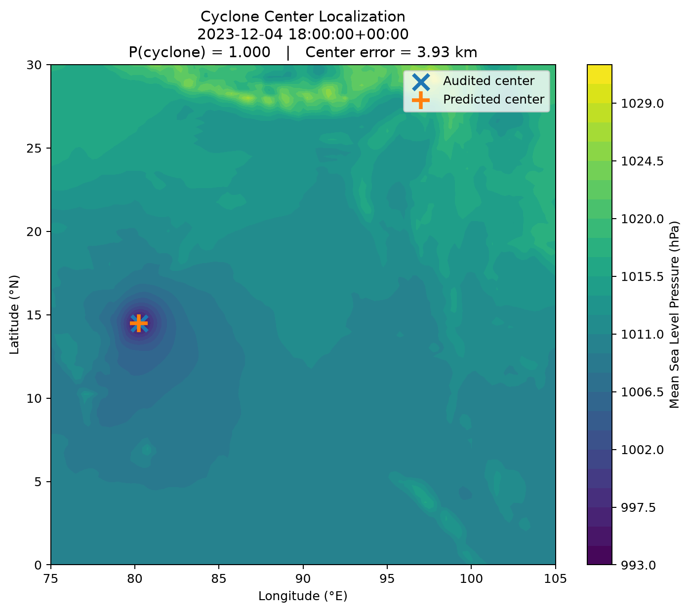
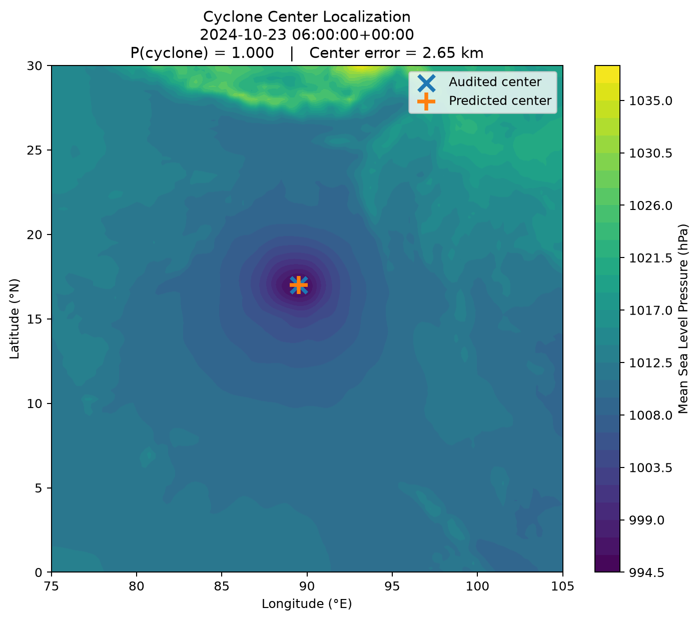
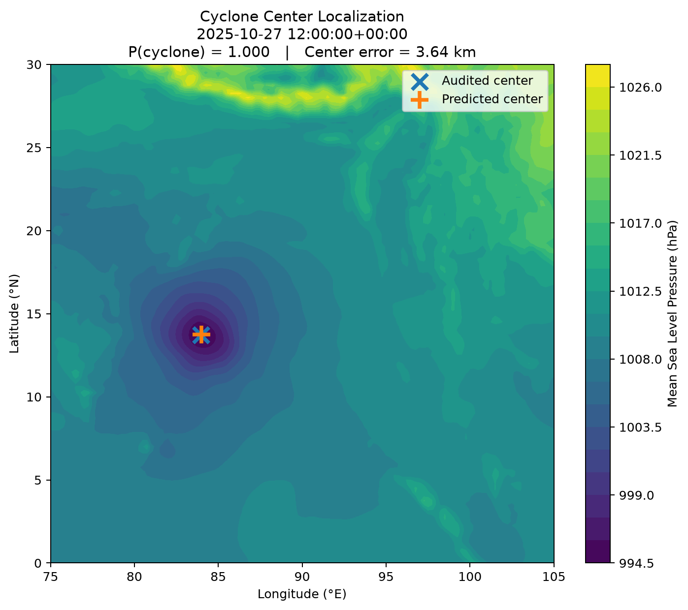

# Cyclone Presence Detection and Center Localization from ERA5 MSLP

A deep-learning research project for detecting tropical cyclone presence and localizing cyclone centers from regional ERA5 mean sea level pressure (MSLP) fields over the Bay of Bengal and surrounding region.

The project investigates whether a convolutional neural network can learn both:

1. **Cyclone presence detection** — determine whether a regional atmospheric frame contains a tropical cyclone.
2. **Cyclone center localization** — estimate the cyclone center when a cyclone is present.

The current primary experiment uses **MSLP only**, providing a simple and meteorologically interpretable baseline for cyclone detection and localization.

<p align="center">
  
</p>

<p align="center">
  <em>
    Example cyclone detection from the held-out test set (23 October 2024, 06:00 UTC).
    SST is shown only to distinguish ocean from land; MSLP contours represent the
    pressure field used by the model.
  </em>
</p>

---

## Study Region

The model operates on a fixed regional domain:

- **Latitude:** 0°–30°N
- **Longitude:** 75°–105°E
- **Grid:** 121 × 121
- **Spatial resolution:** approximately 0.25°
- **Primary atmospheric variable:** ERA5 mean sea level pressure (MSLP)

This domain covers the Bay of Bengal and surrounding regions affected by tropical cyclones.

---

## Dataset

The Experiment 03 dataset contains:

| Class | Samples |
|---|---:|
| Cyclone frames | 1,900 |
| Non-cyclone frames | 1,900 |
| **Total** | **3,800** |

Positive samples contain cyclone events with audited cyclone-center labels.

Negative samples are ERA5 regional frames selected outside known cyclone periods.

The dataset uses fixed **training, validation, and test splits** so that the same samples are used consistently across experiments.

The final test set contains:

- 341 cyclone frames
- 341 non-cyclone frames
- **682 total samples**

Large materialized arrays are not stored directly in this repository. Dataset access and structure are described in [`docs/dataset.md`](docs/dataset.md).

---

## Dataset Access

The materialized Experiment 03 dataset is hosted separately on Google Drive because the NumPy arrays are too large to include directly in this repository.

**Google Drive dataset:** [Cyclone Center Detection — Experiment 03 Dataset](https://drive.google.com/drive/folders/1iFBOL6tDfCgMUUQl-TfOUjtCeKvNpcXn?usp=sharing)

The package contains:

- 1,900 positive cyclone MSLP frames
- 1,900 negative non-cyclone frames
- positive cyclone-center target heatmaps
- latitude and longitude grids
- sample manifests
- fixed train/validation/test split information

After downloading, place the data under:

```text
data/
├── center_detection_v1/
└── center_detection_v2/
```

Detailed file descriptions and verified array shapes are provided in [`docs/dataset.md`](docs/dataset.md).

---

## Model

Experiment 03 uses a **multi-task convolutional neural network** with a shared spatial encoder and two prediction tasks.

```text
                 Regional MSLP
                  1 × 121 × 121
                       │
                       ▼
                 Shared CNN Encoder
                       │
               ┌───────┴────────┐
               │                │
               ▼                ▼
         Presence Head     Localization Head
               │                │
               ▼                ▼
         P(cyclone)        Center Heatmap
```

### Presence Detection

The presence head predicts the probability that a cyclone exists within the regional frame.

```text
Output → P(cyclone)
```

### Center Localization

The localization head produces a spatial heatmap representing the predicted cyclone-center location.

The highest-response location in the predicted heatmap is converted from grid coordinates to latitude and longitude and compared with the audited cyclone center.

Localization loss is applied only to positive cyclone samples.

More details are available in [`docs/methodology.md`](docs/methodology.md).

---

## Experiment 03

Experiment 03 introduces negative ERA5 frames so that the model must distinguish cyclone conditions from non-cyclone atmospheric patterns while simultaneously learning cyclone-center localization.

**Input**

```text
ERA5 MSLP
1 × 121 × 121
```

**Outputs**

```text
Cyclone presence probability
+
Cyclone-center heatmap
```

The model was trained using learning-rate reduction and early stopping. Model selection was performed using validation performance.

The **best validation checkpoint occurred at Epoch 11**, with a validation score of **0.8695**. This checkpoint was subsequently evaluated on the held-out test set.

---

# Results

## Presence Detection

| Metric | Validation | Test |
|---|---:|---:|
| Accuracy | 96.41% | **94.13%** |
| Precision | 96.83% | **94.13%** |
| Recall | 95.96% | **94.13%** |
| F1 | 96.40% | **94.13%** |

### Test Confusion Counts

| Outcome | Count |
|---|---:|
| True positives | 321 |
| True negatives | 321 |
| False positives | 20 |
| False negatives | 20 |

The final test set contains 341 cyclone and 341 non-cyclone frames. The model correctly detected **321 of 341 cyclone frames**, corresponding to a cyclone detection rate of **94.1%**.

---

## Center Localization

Localization is evaluated in two ways:

1. across **all true cyclone frames**, including cyclone frames missed by the presence classifier;
2. conditionally among cyclone frames that were **successfully detected**.

### All True Cyclone Frames

| Metric | Validation | Test |
|---|---:|---:|
| Mean error | 37.41 km | **43.19 km** |
| Median error | 15.93 km | **19.03 km** |
| Within 25 km | 75.8% | **64.8%** |
| Within 50 km | 91.9% | **90.3%** |
| Within 100 km | 96.0% | **95.3%** |

The test values above are calculated across all **341 true cyclone frames**, including false-negative cyclone frames.

### Successfully Detected Cyclones — Test Set

Among the **321 cyclone frames correctly identified** by the presence classifier:

| Metric | Test Result |
|---|---:|
| Mean localization error | **25.22 km** |
| Median localization error | **18.57 km** |
| Within 25 km | **67.0%** |
| Within 50 km | **92.2%** |
| Within 100 km | **97.5%** |

This conditional evaluation shows that localization is generally accurate once the cyclone has been successfully detected.

> **Note:** The primary localization result across all true cyclone test frames is a mean error of **43.19 km**. The lower **25.22 km** mean error is conditional on successful cyclone detection.

---

## Validation vs. Test Generalization

Performance decreases moderately from validation to the held-out test set:

- Presence F1: **96.40% → 94.13%**
- Mean localization error: **37.41 km → 43.19 km**
- Median localization error: **15.93 km → 19.03 km**
- Within 50 km: **91.9% → 90.3%**

The test set was not used for checkpoint selection; the best checkpoint was selected from validation performance at Epoch 11.

---

## Example Predictions

The following figures show selected **low-error predictions from the held-out test set**.

These examples were deliberately selected to illustrate successful localization and therefore should **not** be interpreted as randomly selected or representative test cases. Aggregate performance is reported in the tables above.

The background shows the ERA5 mean sea level pressure field. The **blue ×** indicates the audited cyclone center, while the **orange +** indicates the model prediction.

### Best Localization Example

<p align="center">
  
</p>

<p align="center">
  <b>9 May 2022:</b> localization error = 0.58 km
</p>

### Additional Examples

<table>
<tr>
<td width="50%">

<br>
<b>11 May 2023</b><br>
Center error: 3.32 km
</td>

<td width="50%">

<br>
<b>4 December 2023</b><br>
Center error: 3.93 km
</td>
</tr>

<tr>
<td width="50%">

<br>
<b>23 October 2024</b><br>
Center error: 2.65 km
</td>

<td width="50%">

<br>
<b>27 October 2025</b><br>
Center error: 3.64 km
</td>
</tr>
</table>

---

## Error Analysis

Detailed analysis of Experiment 03 revealed that missed cyclone frames tend to have substantially weaker local MSLP contrast.

A local pressure-deficit diagnostic was defined as:

```text
Local pressure deficit =
environmental mean MSLP − local minimum MSLP
```

The observed test-set statistics were:

| Group | Frames | Mean Deficit | Median Deficit |
|---|---:|---:|---:|
| Detected cyclones | 321 | 10.54 hPa | 8.65 hPa |
| Missed cyclones | 20 | 4.61 hPa | 3.38 hPa |

Missed cyclone frames therefore exhibited substantially weaker pressure deficits on average than successfully detected cyclone frames.

This suggests that **weak pressure signatures are an important failure mode for an MSLP-only detector**.

However, the distributions overlap, indicating that pressure contrast alone does not completely explain detection success.

False-positive analysis also found that some high-confidence detections may correspond to organized low-pressure disturbances occurring before their later representation in IBTrACS.

---

## Repository Structure

```text
cyclone-center-detection/
│
├── README.md
├── .gitignore
├── requirements.txt
│
├── docs/
│   ├── dataset.md
│   ├── methodology.md
│   └── results.md
│
├── figures/
│   ├── cyclone_detection_overview.png
│   └── samples/
│       ├── sample_001998.png
│       ├── sample_002102.png
│       ├── sample_002233.png
│       ├── sample_002337.png
│       └── sample_002391.png
│
├── models/
│   ├── center_detection_experiment_03_final.pt
│   ├── mslp_mean.npy
│   └── mslp_std.npy
│
├── notebooks/
│   ├── center_detection_experiment_03.ipynb
│   └── center_detection_error_analysis.ipynb
│
└── results/
    └── test_predictions.csv
```

---

## Reproducing Experiment 03

The materialized dataset should be placed locally under:

```text
data/
├── center_detection_v1/
└── center_detection_v2/
```

The `data/` directory is intentionally excluded from Git because the materialized arrays are significantly larger than the source code and documentation.

Detailed dataset structure and preparation instructions are provided in [`docs/dataset.md`](docs/dataset.md).

The main experiment can then be inspected and reproduced using:

```text
notebooks/center_detection_experiment_03.ipynb
```

The error-analysis notebook is provided at:

```text
notebooks/center_detection_error_analysis.ipynb
```

---

## Data Sources

This project is based primarily on:

- **ERA5 reanalysis** atmospheric data
- **IBTrACS** tropical cyclone best-track information

IBTrACS information is used for cyclone-track and center-reference information, while ERA5 provides the gridded atmospheric fields used as model inputs.

Users should refer to the original ERA5 and IBTrACS providers for their respective data licenses, citation requirements, and terms of use.

---

## Limitations

The current model:

- operates on a fixed 0–30°N, 75–105°E regional domain;
- uses MSLP as its only model input;
- depends on the quality of cyclone-center labels and negative-frame selection;
- can miss weak-pressure or structurally ambiguous cyclone systems;
- may respond to organized low-pressure disturbances that are not represented as cyclone observations in IBTrACS at the corresponding timestamp.

The model should therefore be considered a **research prototype**, not an operational tropical cyclone warning or forecasting system.

---

## Documentation

Additional documentation:

- [`Dataset`](docs/dataset.md) — dataset construction, files, labels, splits, and materialization
- [`Methodology`](docs/methodology.md) — architecture, inputs, outputs, training, losses, and evaluation
- [`Results`](docs/results.md) — validation/test performance and detailed error analysis

---

## Status

**Experiment 03 — MSLP-only multi-task cyclone presence detection and center localization**

Final held-out test performance:

**Presence F1: 94.13% · Mean center error: 43.19 km across all cyclone frames · 90.3% within 50 km**

Among successfully detected cyclone frames:

**Mean center error: 25.22 km · 92.2% within 50 km**